# Library-Management-System

Hi!, welcome to my repository. The **Library Management System (LMS)** is developed for transforming manual offline workload into online automatic system. It contains all the main 
features such as adding and managing students, books with efficiently maintaining their data. It also contains other security features such as **Captcha Verification** and 
**Password Encryption**. This is a complete LMS with all the necessary functionalties. It also provides feature to **generate report** and **manage fine**.

Note: This is an extended version of Library Management System that can be found [here](https://phpgurukul.com/online-library-management-system/). I have added more advance functionalities like **report generation**.

# Getting Started

These instructions will get you a copy of the project up and running on your local machine for development and testing purposes. 

## Prerequisites

It is good to have basic knowledge of HTML, CSS, PHP and MySQL to understand this project.
>We will use XAMP server as it has cross-platform support and we won't be needed to worry about the operating system support.
Download and install suitable XAMP server from this link - https://www.apachefriends.org/download.html

## Setting up the environment

- Download and extract project source code on your local machine.
- Paste the source code in the htdocs folder. Default path will be here("C:\xampp\htdocs")
- Open XAMP Control Panel and start Apache & MySQL service
- Open your web browser and paste this link ("http://localhost/phpmyadmin/"). It should open database server page.
- Create new empty database named library. Select the library database and import the SQL file given with the source code.
- Review the config file from both of the includes folders. Change username and password accordingly.
- Open your web browser and paste this link ("http://localhost/foldername-in-htdocs-directory/"). It should open login page.
- Use any credentials from database to login. The password for all accounts is set to **Test@123**

# Screenshots

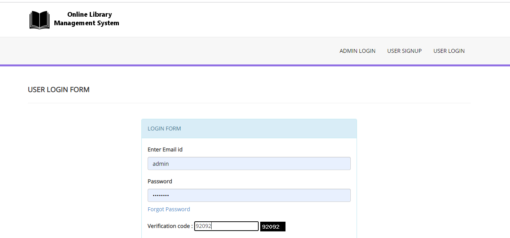

***

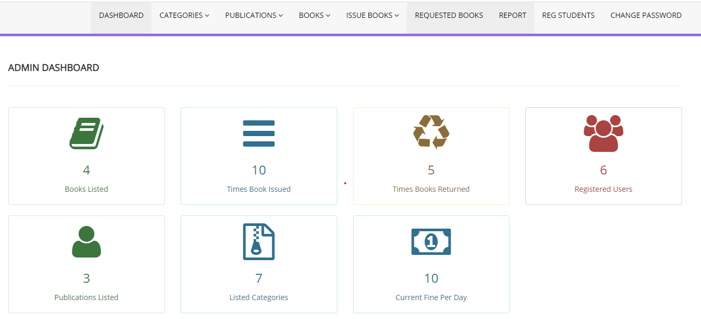
***

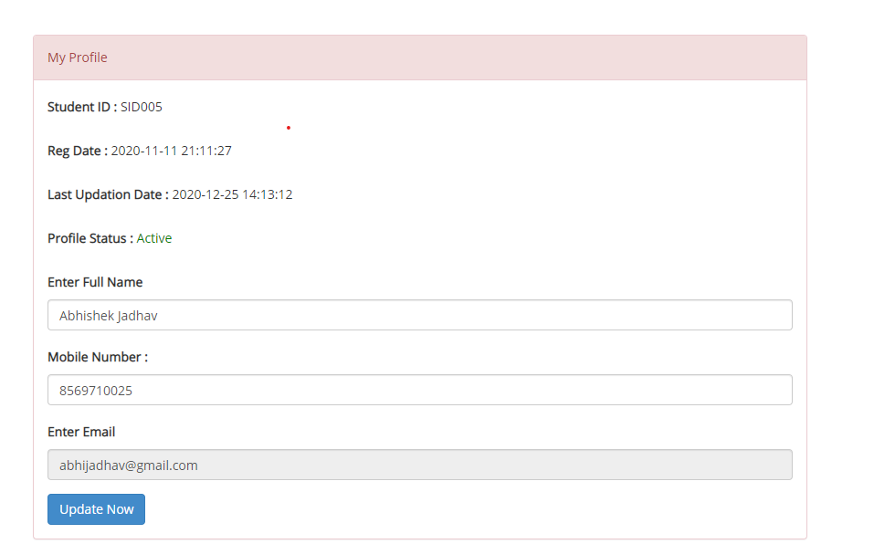

***

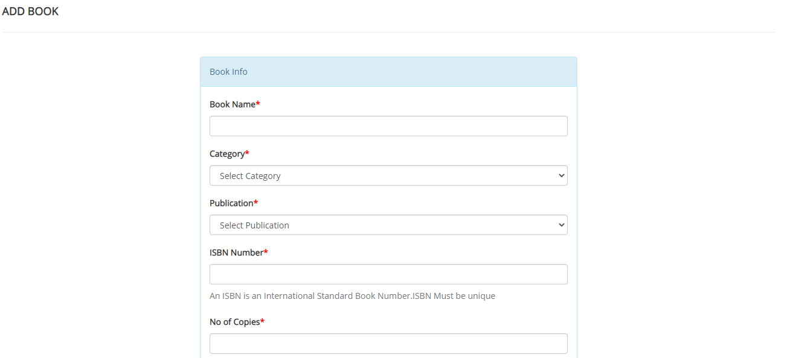

***

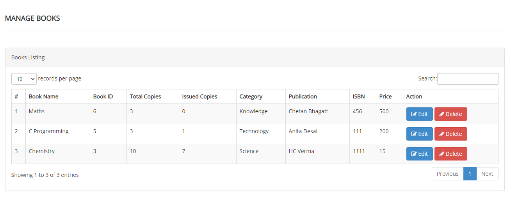

***

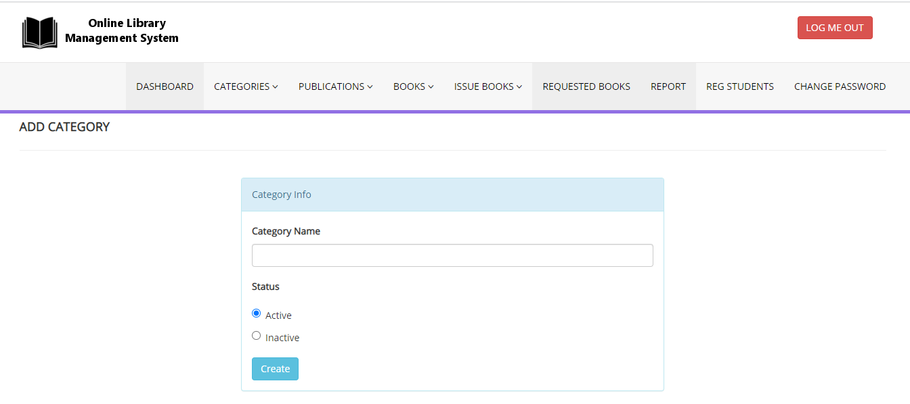

***

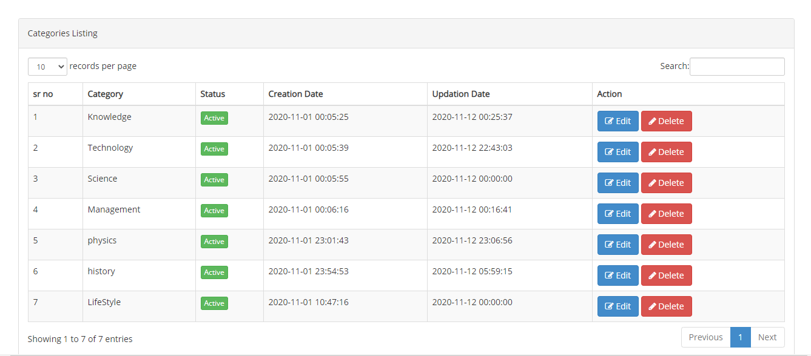

***

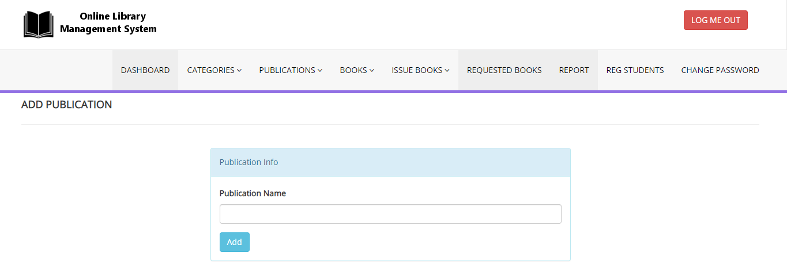

***

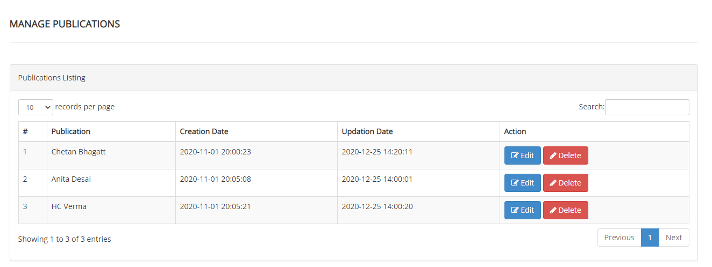

***

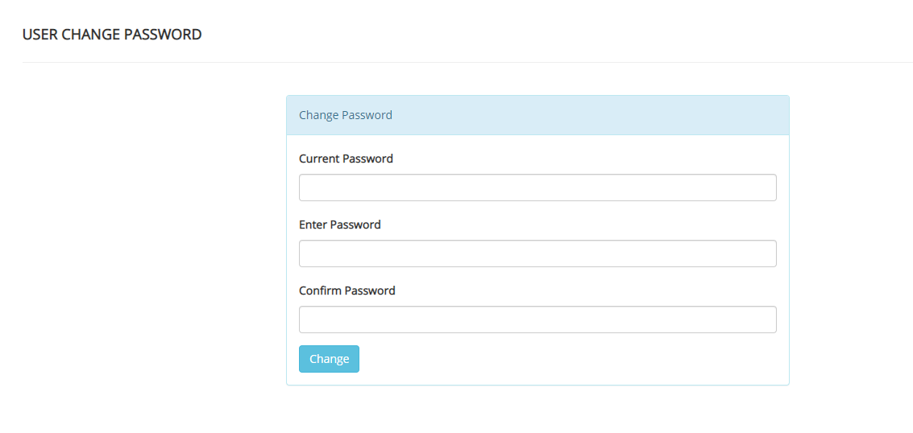

***

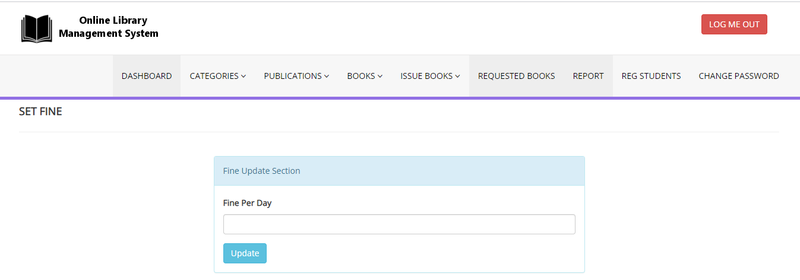

***

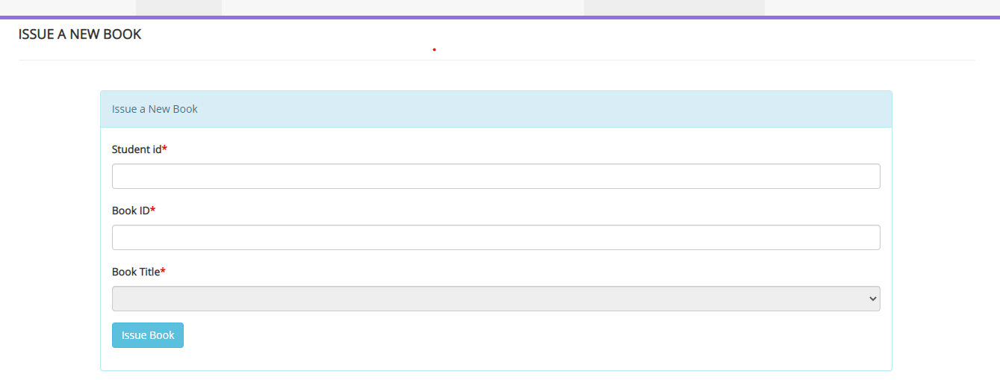

***

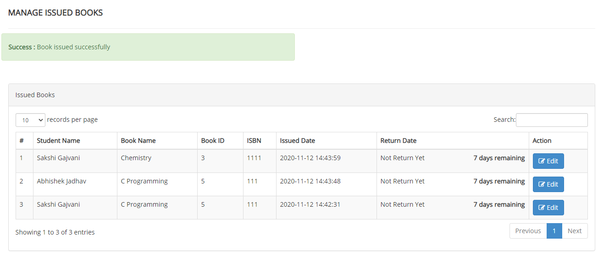

***

***

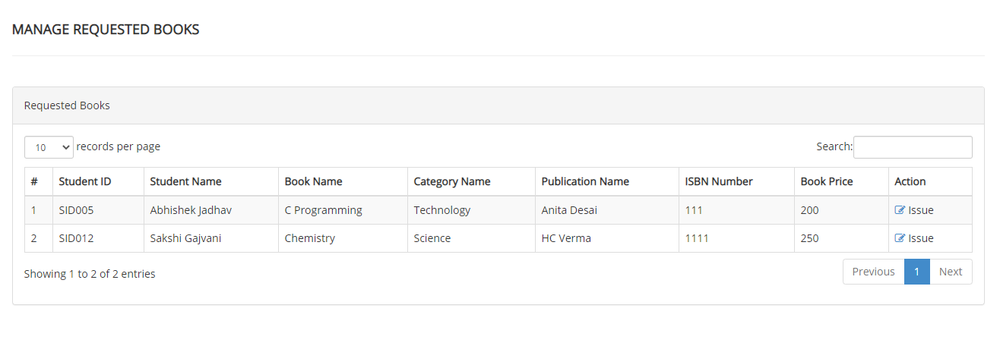

***

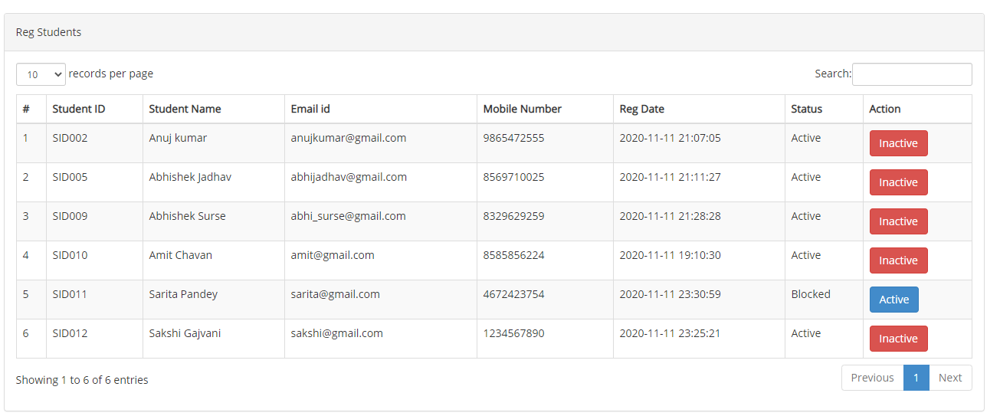

***

***

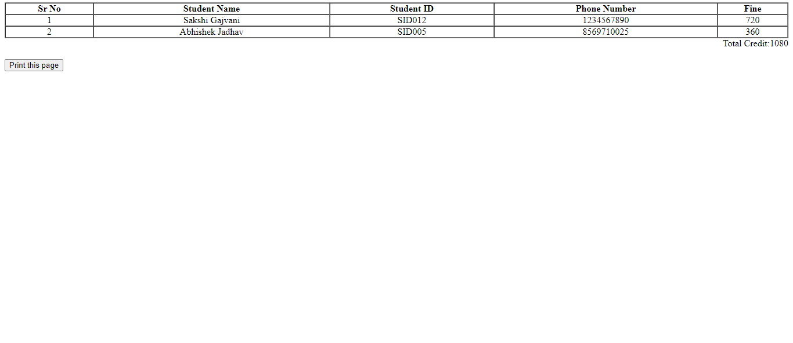

***

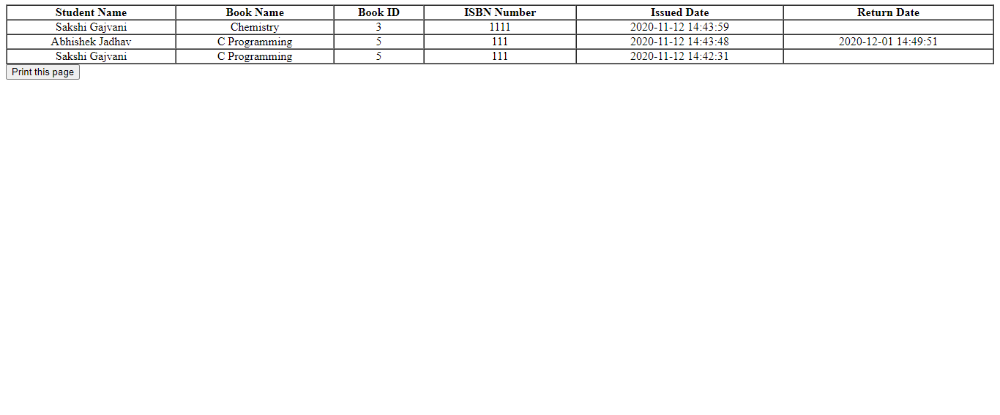
